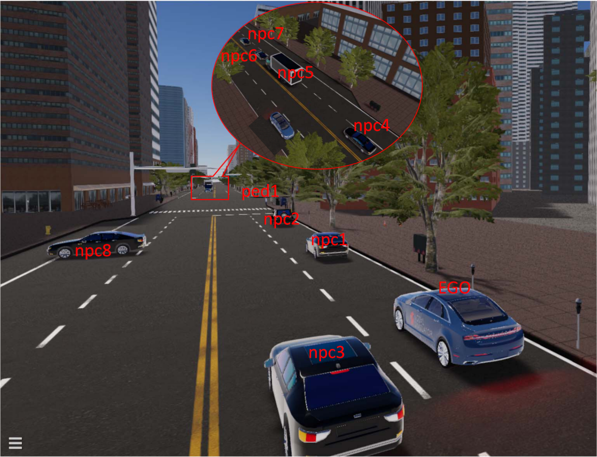

###############################
Generate Scenarios by AVUnit
###############################

A key distinction of AVUnit in comparison to other languages for scenes is that it  provides  a user-friendly and domain-specific way to specifys cenarios, in which objects are executing  independent journey plans in an environment that is dynamically changing. Without specifying scenarios, many real-world behaviours of AVs may not be properly tested. Asking users to fully specify scenarios, however, would be overwhelming, so AVUnit strikes  a  balance by  allowing  them  to  specify  some  key  parts  (e.g. journey waypoints) while leaving the rest to automatic test generation. In  particular, AVUnit supports  an  agent-oriented  style of programming, in which the motions of individual objects arespecified in a fully decoupled way. We will present the key features of the language that support this design in this section.

***********************
Describe a Scenario
***********************
In our desgin, a scenario is composed of six elements: ``map``，``ego vehicl`` ，``npc vehicles`` [Optional]，``pedestrians`` [Optional]，``obstacles`` [Optional]，``environment`` [Optional]. We are going to explore it in this part.

.. _type_map:

Map
==============

``map``: Just specify the name of the loaded map.

BNF Defination:
::

  map ::= load(mapName)

.. note:: 

  The ``map`` here is type of :ref:`String<type_string>`. The BNF defination here is a simplified one. For the complete version, please refer to :doc:`here<Overall_BNF>`.

Related Examples:
::

  map_name = "san_francisco";
  map = load(map_name);

.. _type_egovehicle:

Ego Vehicle
==============

``Ego Vehicle``: The ego vehicle (``egoVehicle``) is the autonomous vehicle targeted for testing. In AVUnit scenarios it is specified using the keyword ``AV``, followed by some optional parameters: 

* The initial state of the ego  vehicle;  
* The  target  state;  
* The type of the vehicle. 

.. note::
	
	Note that if the ego vehicle is generated without these optional parameters, then two randomly generated states will  be  assigned,  and  a  default  vehicle  type  will  be  assigned (e.g. “Lincoln2017MKZ (Apollo 5.0)” for Apollo running with LGSVL).  Note  that  the  language  does  not  require  the  user to  specify  anything  about  the  ego  vehicle’s  motion:  this  is because it is fully controlled by the ADS under test.

BNF Defination:
::

  egoVehicle::= 'AV(' [state ',' state[ ',' type]] ')'

.. note:: 

  The ``state`` here is type of :ref:`State<type_state>`. The ``type`` here is type of :ref:`Object Type<type_objectype>`. The BNF defination here is a simplified one. For the complete version, please refer to :doc:`here<Overall_BNF>`.

Related Examples:
::

  ego_init_state = (ENU (553090.05, 4182687.8));
  ego_target_state = ("lane_40"->50);
  vehicle_type = ("Lincoln MKZ 2017");
  ego_vehicle = AV(ego_init_state, ego_target_state,vehicle_type);

.. note::

  The example specifies  that  the  ego  vehicle  needs  to  move  from the start position (553090.05,4182687.8) in  the  ENU  coordinate system to the lane position which is 50 meters away from the start of Lane “lane40”; its model is Lincoln MKZ 2017.

.. _type_npcvehicle:

Npc Vehicles 
=============

``Npc Vehicles``: Scenes can be populated with NPC  vehicles (``npcVehicle``). Similar to the :ref:`egoVehicle<type_egovehicle>`, AVUnit allows  the  user  to  (optionally)  specify  initial  and  target  states,  but  as  they  are  not controlled  by  the  ADS  under  test,  the  user  can  also  specify their motion. We can use ``npcVehicleList`` to represent NPC vehicles.

BNF Defination:
::

  npcVehicle ::= 'Vehicle('[state[','[motion] [','[state] [','type]]]]')'
  multipleNpcVehicles = npcVehicle | multipleNpcVehicles, npcVehicle
  npcVehicleList ::= '{'[<multipleNpcVehicles>]'}'

.. note:: 

  The ``motion`` here is type of :ref:`Motion<type_motion>`. The ``state`` here is type of :ref:`State<type_state>`. The ``type`` here is type of :ref:`Object Type<type_objectype>`. The BNF defination here is a simplified one. For the complete version, please refer to :doc:`here<Overall_BNF>`.

Related Examples:
::

	heading1 = 10 deg related to ego_vehicle;
	npc_init_state = ("lane_39"->20, , 6.0);
	npc1_type = "Sedan";
	npc_state1 = (("lane_759"->1, ,6), ("lane_759"->20, ,3),("lane_77"->1, ,6), ("lane_77"->30, ,5));
	npc1_destination = ("lane_77"->150);
	npc1 = Vehicle(npc_init_state, Waypoint(npc_state1), npc1_destination, (npc1_type));
	npc_init_state3 = ("lane_779"->0.0, , 1.0);
	npc2 = Vehicle(npc_init_state3);
	npc = {npc1, npc2};

.. _type_pedestrian:

Pedestrians
=============

``Pedestrians``: Similar to the :ref:`egoVehicle<type_egovehicle>`, AVUnit allows  the  user  to  (optionally)  specify  initial  and  target  states of ``Pedestrians``,  but  as  they  are  not controlled  by  the  ADS under test, the user can also specify their motion.  We can use ``pedestrianList`` to represent NPC vehicles.

BNF Defination:
::

	pedestrianList ::= '{'[multiplePedestrians]'}'
	multiplePedestrians ::= pedestrian | multiplePedestrians, pedestrian
	pedestrian ::= 'Pedestrian('[state[','[motion] [','[state] [','pedType]]]]')'

.. note:: 

  The ``motion`` here is type of :ref:`Motion<type_motion>`. The ``state`` here is type of :ref:`State<type_state>`. The ``pedType`` here is type of :ref:`Object Type<type_objectype>`. The BNF defination here is a simplified one. For the complete version, please refer to :doc:`here<Overall_BNF>`.

Related Examples:
::

	ped_position = (553020.54, 4182693.69);
	ped_heading = 90 deg related to "lane_38"->30;
	ped_init_state= (ped_position, ped_heading, 1.0);
	ped_state_list = (((553020.54,4182693.69), ped_heading, 1.0),((553023.26, 4182671.82), ped_heading, 1.0));
	ped_motion = Waypoint(ped_state_list);
	ped_type = "Howard";
	ped0 = Pedestrian(ped_init_state, ped_motion, , ped_type);
	ped = {ped0}

.. _type_obstacle:

Obstacles
=============

``Obstacles``: In an AVUnit scenario,  a static obstacle is defined by its position and static type (e.g. sphere,box, cylinder).

BNF Defination:
::

  obstacle ::= 'Obstacle('[position[','staticType]]')'
  obstacles ::= '{'[multipleObstacles]'}'
  multipleObstacles ::= obstacle | multipleObstacles, obstacle

.. note:: 

  The ``position`` here is type of :ref:`Position<type_position>`. The ``staticType`` here is type of :ref:`Object Type<type_objectype>`. The BNF defination here is a simplified one. For the complete version, please refer to :doc:`here<Overall_BNF>`.

Related Examples:
::

	obs_position = (553020.54, 4182693.69);
	obs_type = (sphere, 2)
	obs = Obstacle(obs_position, obs_type)

.. _type_environment:

Environment
=============

``Environment``: AVUnit allows  for  dynamically  changing environments  to  be  specified  in  scenarios.  This  is  achieved simply by specifying the weather to be simulated at different times.  We  can  specify  the  environment  explicitly (``env``),  or leave  the  parameters  empty  in  order  to  use  the  default  environment settings.

BNF Defination:
::

  env ::= 'Environment('[time','weather]')'

.. note:: 

  The ``time`` here is type of :ref:`Time<type_time>`. The ``weather`` here is type of :ref:`Weather<type_weather>`. The BNF defination here is a simplified one. For the complete version, please refer to :doc:`here<Overall_BNF>`.

Related Examples:
::

	time = 12:00;
	weather = {rain:0.5, fog: 0.1, wetness: heavy};
	evn = Environment(time, weather);

.. _type_scenario:

Scenario  Definition
======================

``Scenario``: Finally,  we  can  create  a  scenario  featuring  combinations  of  all  of  the  above  agents  in AVUnit using the ``CreateScenario`` keyword. The user specifies  the  ``map``  to  load,  the  ``ego vehicle``,  lists  of  ``Npc Vehicles`` and  ``pedestrians``  (associated  with  their  independent  uniform/waypoint  motion  configurations),  a  list  of  static  ``objects``,and  (optionally)  the  ``environment``.  Note  that  our  simplified grammar omits the rules for lists of vehicles, pedestrians, and obstacles:  they  are  simply  comma-delimited  lists  defined  in the standard way.

BNF Defination:
::

	scenario ::= 'CreateScenario({	'map';
  					'egoVehicle';
  					'npcVehicleList';
  					'pedestrianList';
  					'obstacleList';
  					'[env';']
	'}'

.. note:: 

  The ``map`` here is type of :ref:`Map<type_map>`. The ``egoVehicle`` here is type of :ref:`Ego Vehicle<type_egovehicle>`. The ``npcVehicleList`` here is type of :ref:`NPC Vehicle<type_npcVehicle>`. The ``pedestrianList`` here is type of :ref:`Pedestrian<type_pedestrian>`.  The ``obstacleList`` here is type of :ref:`obstacle<type_obstacle>`. The ``env`` here is type of :ref:`Environment<type_environment>`. The BNF defination here is a simplified one. For the complete version, please refer to :doc:`here<Overall_BNF>`.

Related Examples:
::

	scenario0 = CreateScenario{	load(map_name);
					ego_vehicle;
					{npc1, npc2};
					{ped};
					{}; // no obstacles;
					env;
	}

.. _scenario_a_complete_example:

***********************
A Complete Example
***********************

The Below picture shows  an  initial  scene  of  a  concrete  scenario,  i.e.,the input of a test case, that we want to test for the `Apollo <https://github.com/ApolloAuto/apollo>`_  ADS on the San_Francisco map. To describe the scenario, we need to describe the motion task of the ego vehicle, the motion of ``npc1``-``npc8`` and the pedestrian ``ped``. Let first describe the details of the scenario and give give its description in AVUnit.

* ``Ego vehicle``:  The  task  of  the  ego  vehicle  is  to  move from the start point(553090.05,4182687.8) to the target location, which is on Lane lane40 and 50 meters away from the lane’s start position.
* ``npc1``: ``npc1`` is 30 meters ahead to the ego vehicle with the same  direction  of  the  ego  vehicle.  It  needs  to  turn  right and reach the position that is 100 meters away to the start point of  the output lane.  The initial speed  is 6m/s, and the  speeds  on  the  junction  lane  and  the  output  lane  are 2m/s and 6m/s, respectively.
*  ``npc2``:  The  initial  relative  position  of ``npc2`` with  respect to  the  ego  vehicle’s  initial  position  is (−50,0) and  the heading is same with the ego vehicle. The motion of npc2 is described by a set of waypoints with specified speed.
* ``npc3``: ``npc3`` is described by an initial state, i.e., the initial position is 10 meters to the start poition of Lane lane38 and  the  initial  speed  is  5.6m/s,  and  the  target  position which is 100 meters to the start position of Lane lane41.
* ``npc4``: ``npc4`` is  located  at  the  position  that  is  10  meters away to the start point of lane lane42 and the heading is opposite to the ego vehicle. It need to move in a constant speed 8m/s along any possible lanes.
* ``npc5``: The initial position of ``npc5`` is 30 meters away to the start point of lane lane42 and is required to move in a  constant  speed  8m/s to  the  destination  located  at  the point 50 meters away to the start of lane lane76.
* ``npc6``: The initial position of ``npc6`` is 40 meters away to the start point of lane lane42 and is required to move to lane lane79. The initial speed is 7m/s. When it moves 1  meter  on  Lane  lane761,  the  speed  changes  to  4m/s,then to 6m/s after moving 3 meters on Lane lane79. It stops after moving 50m on Lane lane79.
* ``npc7``: The behavior of ``npc7`` is similar with ``npc6``, except that its initial position is 50 meters away to the start pointof  Lane  lane42  and  is  required  to  pass  through  Lanes lane762 and lane78.
* ``npc8``: ``npc8`` is stopped on Lane lane36 and is 40 meters away  to  the  start  of  lane36.  The  orientation  is  perpendicular to that of the ego vehicle.
* ``ped``: ``ped`` moves   along   the   crosswalk   with   a   constant  speed 1m/s.  The  initial  and  target  positions  are (553006.37,4182693.24) and (553006.37,4182671.82). It   needs   to   pass   through   the   intermediate   position (553003.37,4182681.82).
* ``weather``:  The  time  of  the  day  is  12:00,  and  the  weather is  raining,  fogging  and  wetness,  whose  degrees  are  0.5, 0.1, and heavy, respectively.

Such a complicated scenario can be described  by AVUnit as follows.

::

	car_model = "Lincoln MKZ 2017";
	ego_init_position = ENU (553090.0522572036,4182687.8);
	ego_init_state = (ego_init_position);
	ego_target_position = "lane_40"->50;
	ego_target_state = (ego_target_position);
	vehicle_type = (car_model);
	ego_vehicle = AV(ego_init_state, ego_target_state,vehicle_type);
	
	npc1_type = "Sedan";
	npc1_heading = 0 deg related to ego_vehicle;
	npc1_init_position = IMU (30, 0);
	npc1_init_state = (npc1_init_position, npc1_heading,6.0);
	npc1_state = (("lane_759"->1, ,2),("lane_77"->1, ,6));
	npc1_destination = ("lane_77"->100);
	npc1 = Vehicle(npc1_init_state, Waypoint(npc1_state), npc1_destination, (npc1_type));
	...
	ped_position = (553006.37, 4182693.24);
	ped_init_state= (ped_position, , 1.0);
	ped_state_list = (((553003.37, 4182681.82), , 1.0));
	ped_destination_state = ((553006.37, 4182671.82))
	ped_motion = Waypoint(ped_state_list);
	ped = Pedestrian(ped_init_state, ped_motion,ped_destination_state);

	time = 12:00;
	weather = {rain:0.5, fog: 0.1, wetness: heavy};
	evn = Environment(time, weather);

	scenario0 = CreateScenario{	load(map_name);
					ego_vehicle;
					{npc1, npc2, npc3, npc4, npc5, npc6,npc7, npc8};
					{ped};
					{}; // no obstacles;
					evn
	};

