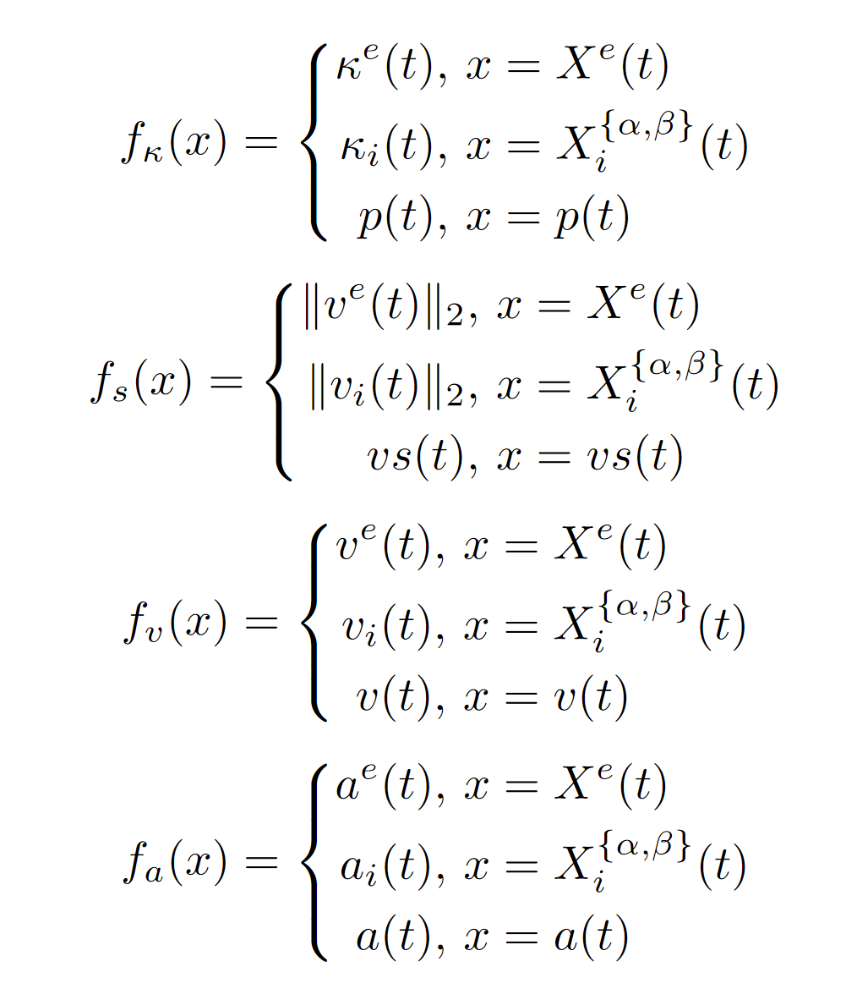

##############################################################
Semantics of Describing Specifications
##############################################################

In the following, we define the semantics of AVUnit (Specification Defination Part).

Let :math:`vs(t)`, :math:`p(t)`, :math:`q(t)`, :math:`v(t)`,  :math:`a(t)`, and :math:`\kappa(t)` be the speed, position, orientation, velocity,  acceleration, and shape at time instant :math:`t`, where :math:`vs(t)\in R`, :math:`p(t), v(t), a(t) \in R^3`, :math:`q(t)\in R^4` is a unit quaternion, and :math:`\kappa(t)` is described as a polygon. We add the subscript to describe the related object.
Hence, at any time instant :math:`t`, the status of the ego vehicle is denoted as 
:math:`X^e(t) =[p^e(t), q^e(t), v^e(t), a^e(t), \kappa^e(t)]`; 
let 
:math:`X_i^\alpha(t)` :math:`=` :math:`[p_i^\alpha(t)`, :math:`q_i^\alpha(t)`, :math:`v_i^\alpha(t)`, :math:`a_i^\alpha(t)`,  :math:`\kappa_i^\alpha(t)]` and
:math:`X_i^\beta(t)` :math:`=` :math:`[p_i^\beta(t)`, :math:`q_i^\beta(t)`, :math:`v_i^\beta(t)`, :math:`a_i^\beta(t)`, :math:`\kappa_i^\beta(t)]` be the status of agent :math:`i` obtained from the perception module and the ground truth, respectively. 
Then, the  trace can be denoted as :math:`\pi = \langle \mathbf{x}(t_0), \mathbf{x}(t_1), \ldots, \mathbf{x}(t_n) \rangle`, where :math:`\mathbf{x}(t)= [X_0(t), X_i^\alpha(t), X_i^\beta(t)]`.

***********************
Expression Semantics
***********************

For the expression semantics, we explain the computation of perception difference, position distance, velocity distance, speed distance, and acceleration distance.

``Defination 5``: Given the perception result :math:`X_i^\alpha` and the ground truth :math:`X_i^\beta` of an agent :math:`i`, the perception difference at time instant :math:`t` is defined as the weighted sum of the errors of position, orientation, velocity, and shape.

.. math::

    diff(X_i^\alpha, X_i^\beta)(t) = & w_1 d_1(p_i^\alpha(t), p_i^\beta(t)) + w_2 d_2(q_i^\alpha(t), q_i^\beta(t))\\
    + & w_3 d_3(v_i^\alpha(t), v_i^\beta(t)) + w_4 d_4(\kappa_i^\alpha(t), \kappa_i^\beta(t))

where :math:`d_1(p_i^\alpha(t), p_i^\beta(t))=\|p_i^\alpha(t) - p_i^\beta(t)\|_2`, :math:`d_2(q_i^\alpha(t), q_i^\beta(t))=  \arccos{q_i^\alpha(t)\dot q_i^\beta(t)}, \|p_i^\alpha(t) - p_i^\beta(t)\|_2`, :math:`d_3(v_i^\alpha(t), v_i^\beta(t))=\|v_i^\alpha(t)- v_i^\beta(t)\|_2`, :math:`d_4(\kappa_i^\alpha(t), \kappa_i^\beta(t)) = 1- \frac{|\kappa_i^\alpha(t) \bigcap \kappa_i^\beta(t)|}{|\kappa_i^\beta(t)|}`, :math:`|\kappa|` denotes the area of the polygon :math:`\kappa`, and :math:`w_1-w_4` are normalized weights satisfying :math:`w_1+w_2+w_3+w_4=1`.

Let :math:`f_\kappa`,  :math:`f_s`, :math:`f_v`, :math:`f_a` be the mappings of position region, speed, velocity, and acceleration from the object status, respectively. Then we have the following semantics for position, speed, velocity, and acceleration expressions.

``Defination 6``: Given two signals :math:`e_1` and :math:`e_2`, the computations of :math:`dis(e_1,e_2)`, :math:`spd(e_1,e_2)`, :math:`vel(e_1,e_2)`, :math:`acc(e_1,e_2)` is defined as follows.

.. math::

    dis(e_1, e_2)(t) = &\min_{\substack{p_1\in f_\kappa(e_1(t)), \\ p_2\in f_\kappa(e_2(t))}} \| p_1- p_2\|_2, e_1, e_2\in X \cup \{p\} \\%\{X^e, X_i^\alpha, X_i^\beta, p\}\\
    spd(e_1, e_2)(t) = &f_s(e_1(t)) - f_s(e_2(t)), e_1, e_2\in X \cup \{ vs\}\\
    vel(e_1, e_2)(t) = &\|f_v(e_1(t)) - f_v(e_2(t))\|_2, e_1, e_2\in X \cup \{v\}\\
    acc(e_1, e_2)(t) = & \|f_a(e_1(t)) - f_a(e_2(t))\|_2, e_1, e_2\in X \cup \{ a\}

where :math:`X=\{X^e(t), X_i^\alpha(t), X_i^\beta(t)\}`.

**********************************************
Satistic Semantics
**********************************************

``Defination 7``: [Satisfaction Semantics]
Given an assertion :math:`\phi` from AVUnit's syntax, the satisfaction relation of the assertion :math:`\phi` with respect to a trace :math:`\pi` at time :math:`t` can be defined as:

.. math::

    (\pi,t)  & \vDash   \mu & \iff & f(\pi)(t) \geq 0\\
    (\pi,t)  & \vDash   \neg \phi &  \iff &  -((\pi,t)  
    \vDash \phi) \\
    (\pi,t)  & \vDash  \ \phi_1 \land \phi_2 & \iff & (\pi,t)   \vDash  \ \phi_1 \land (\pi,t)   \vDash  \ \phi_2\\
    (\pi,t)  & \vDash  \ \phi_1 \lor \phi_2 & \iff & (\pi,t)   \vDash  \ \phi_1 \lor (\pi,t)   \vDash  \ \phi_2\\
    (\pi,t)  & \vDash  \phi_1 \;\mathcal{U_I}\; \phi_2 & \iff & \exists t' \in t+\mathcal{I} \text{ such that } (\pi,t') \vDash \phi_2 \land \\
    & &&\forall t'' \in [t,t'], (x,t'') \vDash \phi_1\\
    (\pi,t)  & \vDash  \Diamond_\mathcal{I}\phi & \iff & \exists t' \in t+\mathcal{I} \text{ such that } (\pi,t') \vDash \phi\\
    (\pi,t)  & \vDash  \Box_\mathcal{I}\phi& \iff &
    \forall t' \in t+\mathcal{I},\  (\pi,t') \vDash \phi\\
    (\pi,t)  & \vDash  \bigcirc \phi& \iff &
     (\pi,t+1) \vDash \phi

**********************************************
Quantitative Semantics
**********************************************
In AVUnit, we applies the quantitative semantics of STL to measure the satisfaction of an AVUnit assertion.

Based on the satisfaction semantics, in the following, we define the quantitative semantics for AVUnit, which allows us to evaluate not only whether an AVUnit formula :math:`\phi` is satisfied but also how far it is from being violated or satisfied. 

``Defination 8``: [Quantitative Semantics]
Given a trace :math:`\pi` and an AVSpec assertion :math:`\phi` which is defined according to the above syntax, the quantitative semantics is defined as the robustness degree :math:`\rho(\phi, \pi,t)` which returns a real value. The function :math:`\rho` is defined as follows.

.. math::

    \rho(\mu,\pi,t) & = f(\pi) \\
    \rho(\neg\phi,\pi,t) & = -\rho(\phi,\pi,t) \\
    \rho(\phi_1 \land \phi_2,\pi,t) & = \min\{\rho(\phi_1,\pi,t),\rho(\phi_2,\pi,t)\} \\
    \rho(\phi_1 \lor \phi_2,\pi,t) & = \max\{\rho(\phi_1,\pi,t),\rho(\phi_2,\pi,t)\} \\
    \rho(\phi_1 \;\mathcal{U_I}\; \phi_2,\pi,t) & = \sup_{t'\in t+I}\ \min \{\rho(\phi_2,\pi,t'), \inf_{t'' \in [t,t']} \rho(\phi_1,\pi,t'')\} \\
    \rho(\Diamond_\mathcal{I}\phi,\pi,t) & = \sup_{t'\in t+\mathcal{I}}\rho(\phi,\pi,t') \\
    \rho(\Box_\mathcal{I}\phi,\pi,t) & = \inf_{t'\in t+\mathcal{I}}\rho(\phi,\pi,t')\\
    \rho(\bigcirc \phi,\pi,t) & = \rho(\phi,\pi,t+1)

For example, suppose the distance sequence between the ego vehicle and the NPC vehicle :math:`npc1` is :math:`\pi_d = \{(t, d): (t_0, 10)`, :math:`(t_1, 8.69)`, :math:`(t_2, 7.32)`, :math:`(t_3, 6.3)`, :math:`(t_4, 5.4)`, :math:`(t_5, 4.5)`, :math:`(t_6, 5.0)`, :math:`\ldots`, :math:`(t_n, d_n)`, :math:`\ldots\}` where :math:`d_n > 5.0` when :math:`t_n>t_6`, and the related assertion is :math:`\mu = G (d>3.0)`, then we have :math:`\rho(\mu, \pi_d, t_0) = 1.5`, where the minimal one is reached at :math:`t_5`. It means that the assertion :math:`\mu` is satisfied for :math:`\pi_d`.

